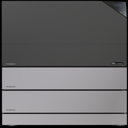

<p align="center">
  
</p>

<h1 align="center">Ampere StoragePro E3</h1>

<p align="center">
  Home-Assistant-Integration für den <b>Ampere StoragePro E3</b> Hybrid-Wechselrichter / Batteriespeicher (FoxESS-basiert) – komplett lokal über <b>Modbus TCP</b>, ohne Cloud.
</p>

<p align="center">
  <a href="https://github.com/hacs/integration"></a>
  
  
  
</p>

---

## ✨ Features

- 🔌 **Lokal über Modbus TCP** – keine Cloud, keine Zugangsdaten nötig
- ⚡ **Umfangreiche Sensorik**: PV-Strings & MPPTs, Netz, Last, EPS/Notstrom, Wechselrichter-Leistungen
- 🔋 **Batterie / BMS**: SoC, SOH, Spannung, Strom, Temperaturen sowie Fehler- und Alarmstatus im Klartext
- 📊 **Native Energiezähler** (kWh) direkt aus dem Gerät – ideal fürs **Energie-Dashboard**
- 🧩 **Automatische Erkennung** von BMS1/BMS2 und Meter1/Meter2 – nicht verbundene Komponenten werden ausgeblendet
- ⚙️ **Effizientes Polling** über einen zentralen Coordinator mit persistenter Verbindung
- 🌐 Oberfläche auf **Deutsch & Englisch**

## 📦 Installation

### Über HACS (empfohlen)

1. HACS öffnen → **⋮** → **Benutzerdefinierte Repositories**
2. Repository `Sven0111/Ampere-StoragePro-E3` hinzufügen, Kategorie **Integration**
3. **Ampere StoragePro E3** herunterladen
4. **Home Assistant neu starten**

[](https://my.home-assistant.io/redirect/hacs_repository/?owner=Sven0111&repository=Ampere-StoragePro-E3&category=integration)

### Manuell

1. Ordner `custom_components/ampere_storagepro_e3` in das `config/custom_components`-Verzeichnis deiner HA-Installation kopieren
2. **Home Assistant neu starten**

## ⚙️ Einrichtung

*Einstellungen → Geräte & Dienste → Integration hinzufügen* → **Ampere StoragePro E3**

| Feld | Beschreibung | Standard |
|------|--------------|----------|
| **Host / IP-Adresse** | IP des Wechselrichters bzw. Modbus-Gateways | – |
| **Port** | Modbus-TCP-Port | `502` |
| **Modbus Slave-ID** | Geräteadresse auf dem Bus | `247` |

> 💡 Modell, Seriennummer und Hersteller werden beim Einrichten automatisch ausgelesen.

### Optionen

Nachträglich änderbar unter *Konfigurieren*:

- **Aktualisierungsintervall**: 10 / 30 / 60 / 120 Sekunden
- **Diagnose-Sensoren** aktivieren/deaktivieren

## 🔗 Verbindung über Modbus Proxy (empfohlen)

Der StoragePro E3 akzeptiert in der Regel nur **eine** gleichzeitige Modbus-TCP-Verbindung. Damit mehrere Dienste parallel zugreifen können und die Verbindung stabil bleibt, wird ein **Modbus Proxy** vorgeschaltet – die Integration verbindet sich dann mit dem Proxy statt direkt mit dem Gerät.

Getestetes Setup mit dem Home-Assistant-Add-on **[Modbus Proxy](https://github.com/TCzerny/ha-modbusproxy)** (Version **2.2.7**): Der Proxy lauscht lokal auf **Port `502`** und leitet an den Wechselrichter weiter. In der Integration werden dann diese Werte eingetragen:

| Feld | Wert |
|------|------|
| **Host** | `127.0.0.1` (bzw. die Adresse des Proxy-Hosts) |
| **Port** | `502` |
| **Slave-ID** | `247` |

Beispiel-Konfiguration des Add-ons:

```yaml
modbus_devices:
  - name: Solar Inverter 1
    protocol: tcp
    host: <IP-des-Wechselrichters>   # echte IP des StoragePro E3
    port: 502
    bind_port: 502                   # lokaler Port, mit dem sich HA verbindet
    device: "247"                    # Modbus Slave-/Unit-ID
    timeout: 4
```

## 📈 Energie-Dashboard

Für das HA-Energie-Dashboard eignen sich die nativen kumulativen Zähler:

| Bereich | Sensor |
|---------|--------|
| ☀️ Solarerzeugung | `PV Power Total` / `Total PV input Power` |
| 🔋 Batterie laden | `Total Charging Capacity` |
| 🔋 Batterie entladen | `Total Discharge Power` |
| ⬇️ Netzbezug | `Total Power Taken` |
| ⬆️ Netzeinspeisung | `Total Feeder Network Power` |
| 🏠 Hausverbrauch | `Total Load Power` |

## 🧰 Voraussetzungen

- Home Assistant mit Zugriff auf den **Modbus-TCP-Endpunkt** des Geräts (direkt oder via Gateway)
- Der StoragePro E3 muss Modbus TCP bereitstellen (Standardport `502`)

## ❓ Troubleshooting

| Symptom | Hinweis |
|---------|---------|
| *„not ready" / keine Verbindung* | Host/Port/Slave-ID prüfen; ist der Modbus-Endpunkt erreichbar (z. B. `telnet <host> 502`)? |
| Werte aktualisieren langsam | Aktualisierungsintervall in den Optionen verringern (erhöht die Buslast) |
| BMS2/Meter2 fehlen | Werden nur angezeigt, wenn die Komponente angeschlossen und erkannt ist |

## 🐛 Probleme & Wünsche

Bitte als **Issue** melden: [github.com/Sven0111/Ampere-StoragePro-E3/issues](https://github.com/Sven0111/Ampere-StoragePro-E3/issues)

## 🙏 Credits

Entwickelt von [@Sven0111](https://github.com/Sven0111). Basiert auf dem öffentlichen Modbus-Registerprotokoll des Geräts.

---

<p align="center"><sub>Diese Integration steht in keiner Verbindung zu Ampere, FoxESS oder verbundenen Unternehmen.</sub></p>
